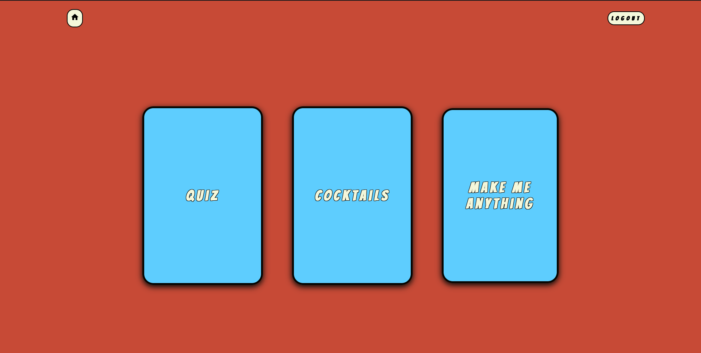
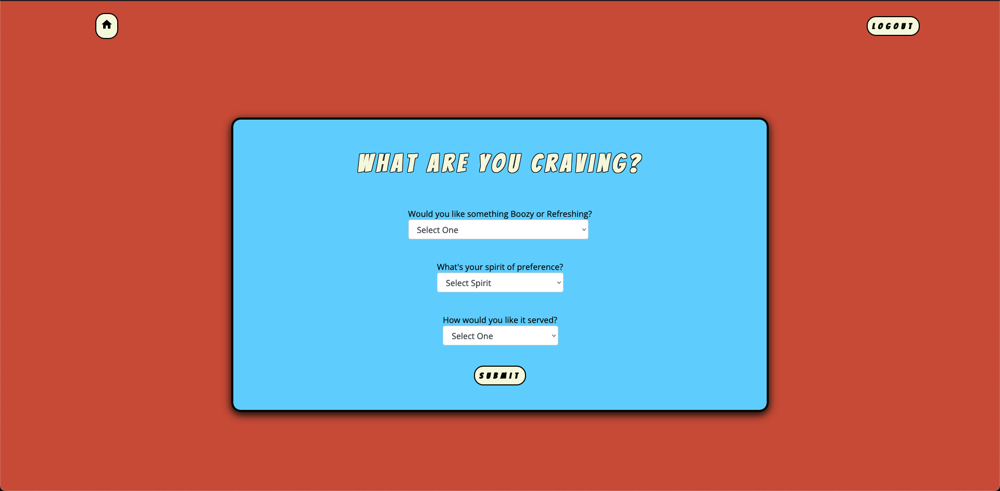
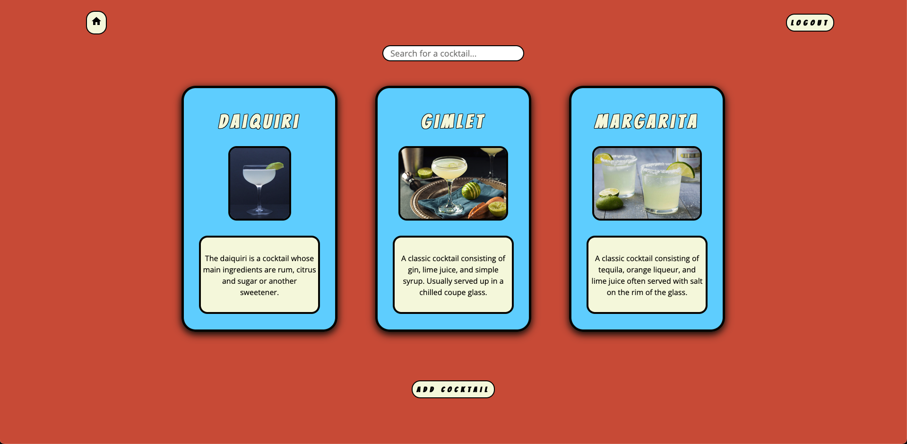

# Welcome to Daisy!
Daisy is my final capstone project for Nashville Software School. It's an application designed to introduce novice cocktail enthusiasts to new recipes as well as act as a general recipe guide for mixologists at every level. Daisy is primarily a library for recipes, but the application also features a quiz, which will generate a cocktail recipe based on your craving, and a random cocktail button for when you just need something new. The frontend was built using ReactJS and the backend was built utilizing the Django framework for Python. All design was done from scratch with CSS.

I'm extremely proud of Daisy because I pushed myself when designing the backend relationships more than I have before. There are several many-to-many relationships in place that provided plenty of challenges along the way. The front end isn't as fleshed out as I would like it to be, but in the end this project was meant to showcase what I've learned about backend development, and I am confident that I accomplished that goal.

## Full CRUD:
- CREATE - create your own cocktail recipes and ingredients
- READ - view existing recipes
- UPDATE - recipes that you have created
- DELETE - recipes that you have created

- Register, Login and Logout functionality

## Stretch Goals:
- filter results by different properties (i.e. favorites, spirit, misc. ingredients, etc.)

## Project Planning:
- [Wireframe](https://miro.com/app/board/uXjVPdMWLjY=/)
- [ERD](https://dbdiagram.io/d/62e171820d66c74655635ba1)

## Screenshots:

### Home

### Quiz

### Cocktail List

## Available Scripts

In the project directory, you can run:

### `npm start`

Runs the app in the development mode. 
Open [http://localhost:3000](http://localhost:3000) to view it in the browser.

The page will reload if you make edits. 
You will also see any lint errors in the console.

### `npm test`

Launches the test runner in the interactive watch mode. 
See the section about [running tests](https://facebook.github.io/create-react-app/docs/running-tests) for more information.

### `npm build`

Builds the app for production to the `build` folder. 
It correctly bundles React in production mode and optimizes the build for the best performance.

The build is minified and the filenames include the hashes. 
Your app is ready to be deployed!

See the section about [deployment](https://facebook.github.io/create-react-app/docs/deployment) for more information.

### `npm eject`

**Note: this is a one-way operation. Once you `eject`, you can’t go back!**

If you aren’t satisfied with the build tool and configuration choices, you can `eject` at any time. This command will remove the single build dependency from your project.

Instead, it will copy all the configuration files and the transitive dependencies (webpack, Babel, ESLint, etc) right into your project so you have full control over them. All of the commands except `eject` will still work, but they will point to the copied scripts so you can tweak them. At this point you’re on your own.

You don’t have to ever use `eject`. The curated feature set is suitable for small and middle deployments, and you shouldn’t feel obligated to use this feature. However we understand that this tool wouldn’t be useful if you couldn’t customize it when you are ready for it.

## Learn More

You can learn more in the [Create React App documentation](https://facebook.github.io/create-react-app/docs/getting-started).

To learn React, check out the [React documentation](https://reactjs.org/).

### Code Splitting

This section has moved here: https://facebook.github.io/create-react-app/docs/code-splitting

### Analyzing the Bundle Size

This section has moved here: https://facebook.github.io/create-react-app/docs/analyzing-the-bundle-size

### Making a Progressive Web App

This section has moved here: https://facebook.github.io/create-react-app/docs/making-a-progressive-web-app

### Advanced Configuration

This section has moved here: https://facebook.github.io/create-react-app/docs/advanced-configuration

### Deployment

This section has moved here: https://facebook.github.io/create-react-app/docs/deployment

### `npm build` fails to minify

This section has moved here: https://facebook.github.io/create-react-app/docs/troubleshooting#npm-run-build-fails-to-minify
