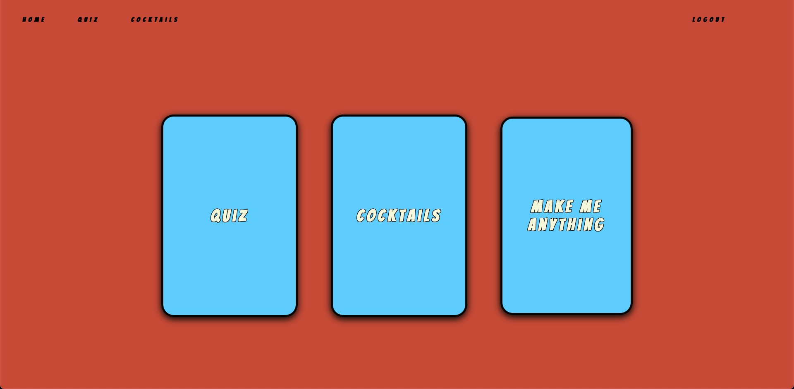

# Daisy is Live! Check it out [here](https://www.makemydaisy.app)!

Daisy is my final capstone project for Nashville Software School. It's an application designed to introduce novice cocktail enthusiasts to new recipes as well as act as a general recipe guide for mixologists at every level. Daisy is primarily a library for recipes, but the application also features a quiz, which will generate a cocktail recipe based on your craving, and a random cocktail button for when you just need something new. The frontend was built using ReactJS and the backend was built utilizing the Django framework for Python. All design was done from scratch with CSS.

The idea for Daisy came because I wanted to create a tool that bartenders and home mixologists alike could use to make sorting through recipes more convenient. Before becoming a developer, I worked in the industry, and I often had to look up recipes on the fly while at work. A lot of the online resources you can find are bogged down with inflated articles and inconsistent specs for recipes. A major goal for Daisy was to keep the app lightweight and convenient to use.

I'm extremely proud of Daisy because I pushed myself when designing the backend more than I have before. There are several many-to-many relationships in place that provided plenty of challenges along the way. This was project was a two week sprint, and considering the short time I was given, I'm happy with how it turned out. It was meant to showcase all that I've learned about backend development, and I think it does exactly that. Thanks for checking it out!

## Full CRUD:
- CREATE - create your own cocktail recipes and ingredients
- READ - view existing recipes
- UPDATE - recipes that you have created
- DELETE - recipes that you have created

- Register, Login and Logout functionality

## Stretch Goals:
- filter results by different properties (i.e. favorites, spirit, misc. ingredients, etc.)

## Project Planning:
- [Wireframe](https://miro.com/app/board/uXjVPdMWLjY=/)
- [ERD](https://dbdiagram.io/d/62e171820d66c74655635ba1)

### Login

### Register

### Home

### Cocktail List

### Cocktail Details

### Add Cocktail

### Cocktail Quiz

### Random Cocktail

## Setting Up The Backend:

Clone the backend repository here: https://github.com/jacobschestnut/daisy-server

While in the project directory, run:

### `pipenv shell`

This starts the shell you need in order to deploy the server locally

Then run:

### `python3 manage.py runserver 8000`

This will run the server on port 8000 locally.

## Setting Up The Frontend:

In the project directory, run:

### `npm start`

Runs the app in the development mode. 
Open [http://localhost:3000](http://localhost:3000) to view it in the browser.
